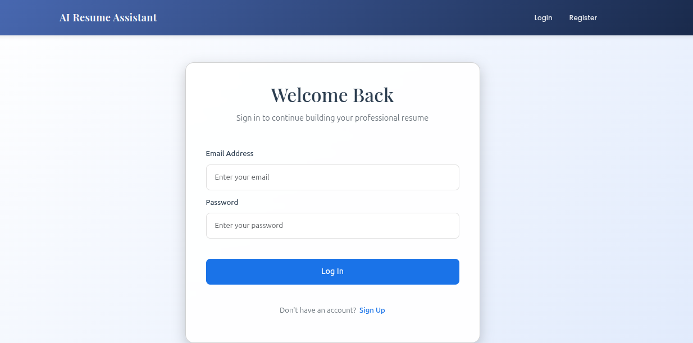
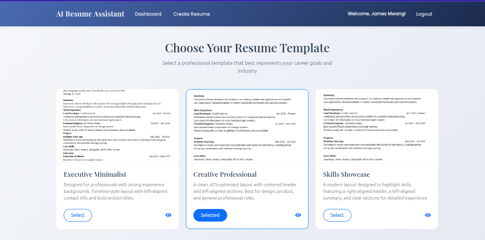
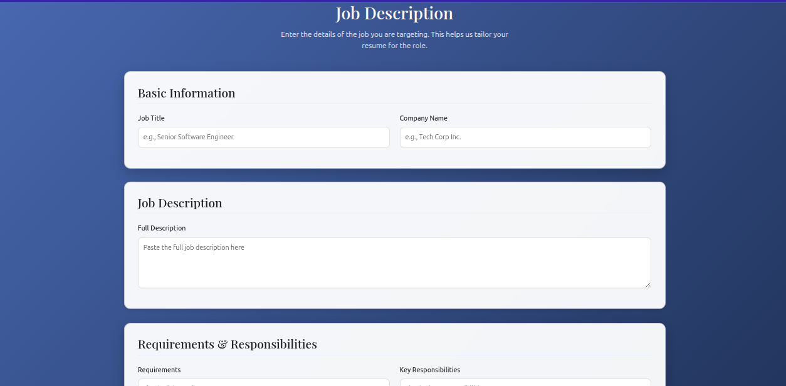
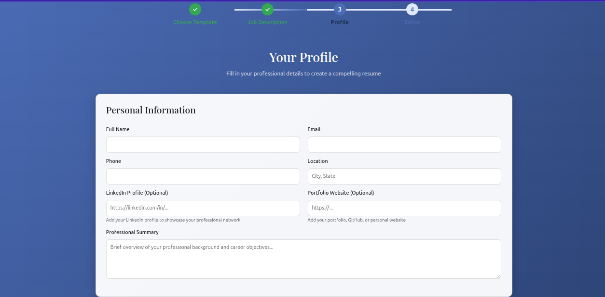
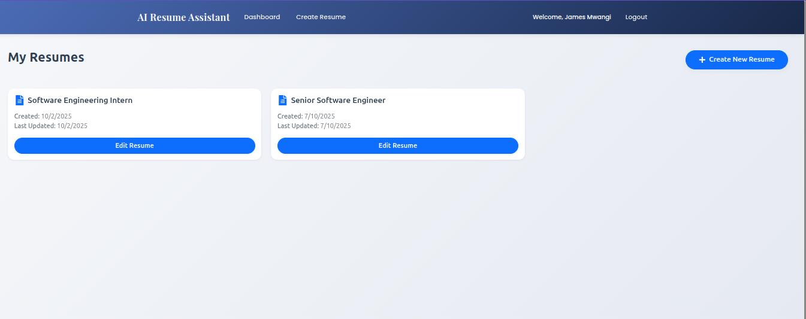
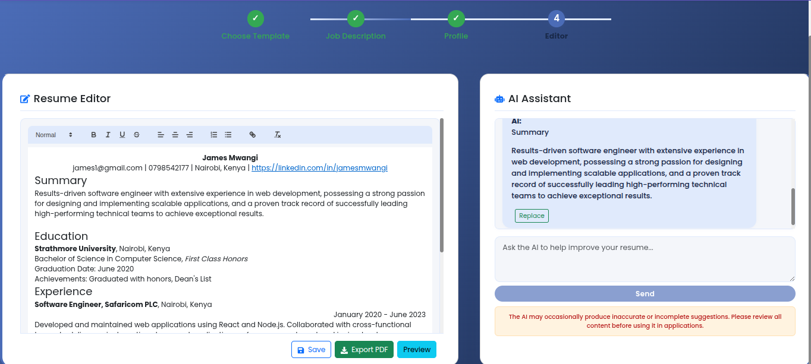
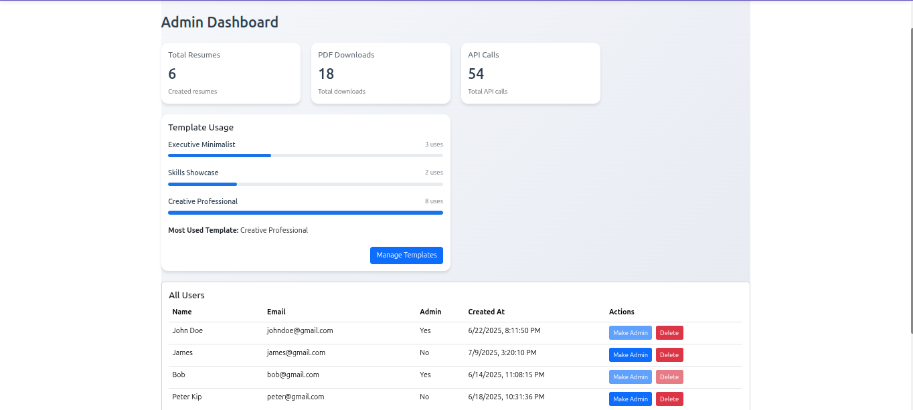
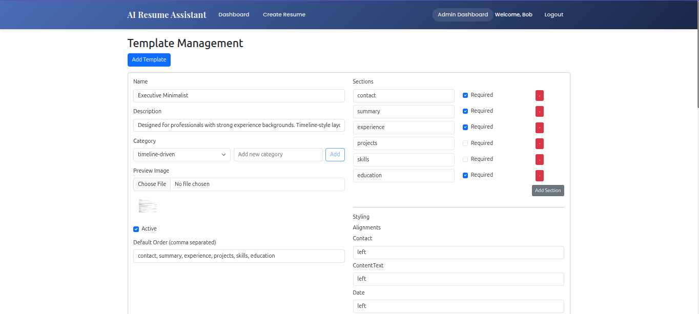

# AI Resume Assistant

An intelligent resume creation and editing platform powered by Together AI's Llama 3.3 70B model.

## Features

- User authentication with Firebase  
- ATS-compliant resume templates  
- AI-powered resume generation and editing  
- Real-time collaborative editing interface  
- Version tracking and auto-save  
- PDF export functionality  
- Responsive design for all devices  
- Admin dashboard for monitoring  

## Tech Stack

- Frontend: React.js with Bootstrap  
- Backend: Express.js  
- Database: Firebase Firestore  
- AI: Together AI (Llama 3.3 70B)  
- Authentication: Firebase Auth  

## Setup Instructions

1. Clone the repository  
2. Install dependencies:  
   npm run install-all

3. Create a `.env` file in the root directory with the following variables:

   TOGETHER_API_KEY=your_together_ai_key
   FIREBASE_CONFIG=your_firebase_config
   PORT=5000

4. Create a `.env` file in the client directory with:
   REACT_APP_FIREBASE_CONFIG=your_firebase_config
   REACT_APP_API_URL=http://localhost:5000

5. Start the development server:
   npm run dev

The application will be available at `http://localhost:3000`

## API Rate Limits

* Together AI: 60 requests per minute
* Implement caching for frequent requests
* Optimize token usage by sending only modified sections

## Screenshots 
1.Login Page

2.Landing Page 

3.Template Selection page

4.Job Description page

5.User Information page

6.User dashboard page

7.Resume Editor page

8.Admin Dashboard page

9.Template Management dashboard

## License
## License
This project is licensed under the ISC License - see the [LICENSE](./License.md) file for details.

